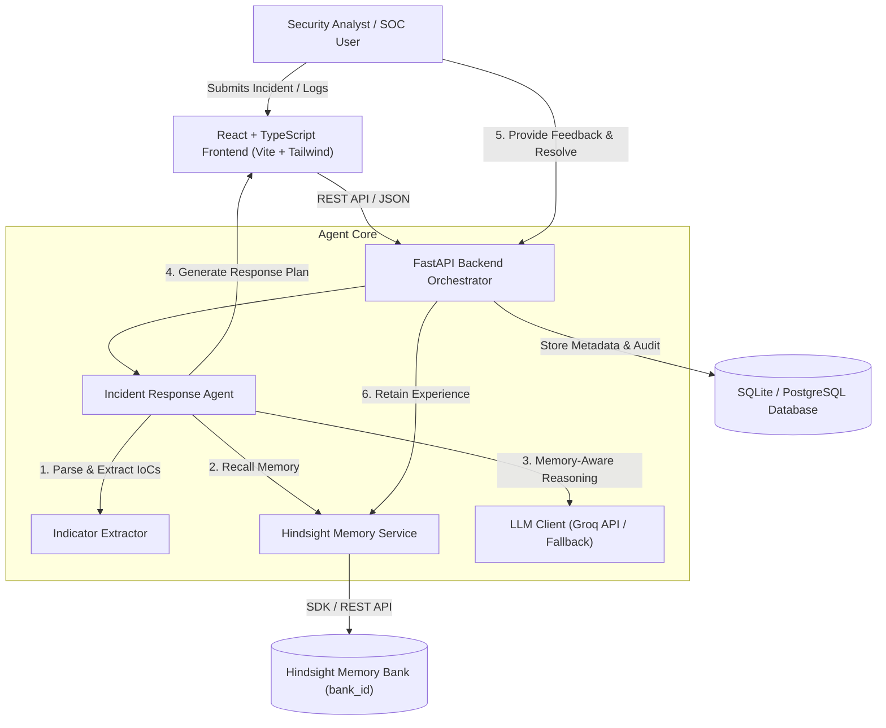
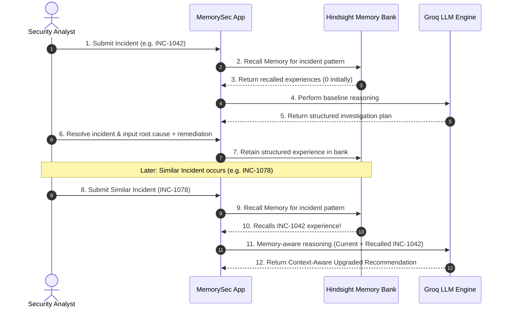

# MemorySec - System Architecture

MemorySec is an AI Incident Response platform that utilizes **Hindsight Persistent Agent Memory** to learn from every security investigation.

## 1. High-Level Architecture

## 2. Component Breakdown

### Frontend (`frontend/`)
- **Technology**: React 18, TypeScript, Vite, Tailwind CSS, Lucide Icons, Recharts.
- **Pages**:
  - `Dashboard`: High-level SOC telemetry, severity distribution chart, recent incidents, recent memories.
  - `NewIncident`: Form submission + 1-click Quick Demo Presets.
  - `IncidentInvestigation`: IoCs, 🧠 Hindsight Memory Panel, Agent Execution Trace, Visual Comparison (`WITHOUT MEMORY` vs `WITH MEMORY`), and Resolve Modal.
  - `MemoryExplorer`: Filterable organizational knowledge base of retained Hindsight experiences.
  - `IncidentHistory`: Searchable audit log of all incidents.
  - `Settings`: Live system connection diagnostics & database re-seeding controls.
  - `DemoScenarioPage`: 1-Click interactive judging demo walkthrough.

### Backend (`backend/`)
- **Technology**: Python 3.13, FastAPI, Pydantic V2, SQLAlchemy, Uvicorn, Pytest.
- **Modules**:
  - `app.api`: REST routers (`/incidents`, `/memory`, `/system`, `/demo`).
  - `app.agents.orchestrator`: Multi-step incident response agent orchestration pipeline.
  - `app.hindsight`: Dedicated Hindsight Memory Service with dual remote API client and local high-fidelity recall engine fallback.
  - `app.llm`: Groq LLM integration (`openai/gpt-oss-120b` / `llama-3.3-70b-versatile`) with structured JSON Pydantic output validation.
  - `app.models`: SQLAlchemy database schemas for Incidents, Events, Analysis, Resolutions, Agent Executions, and Memory References.

## 3. The Memory Learning Loop

